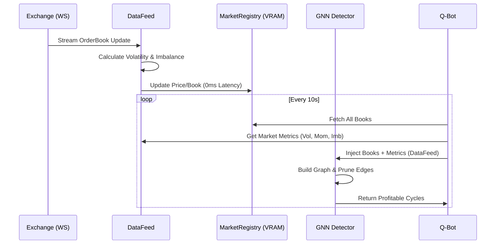
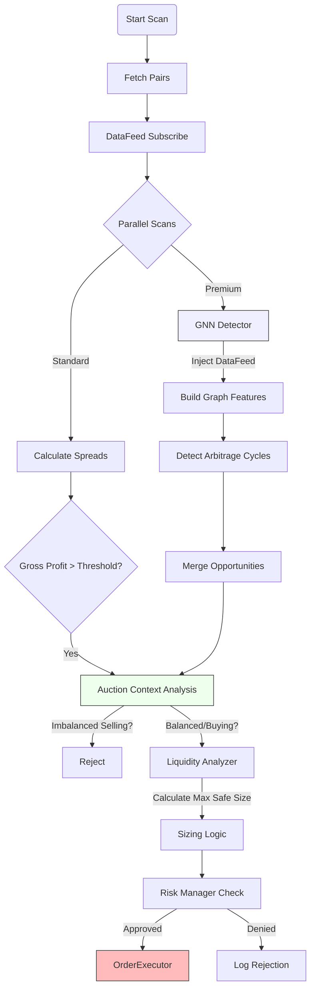
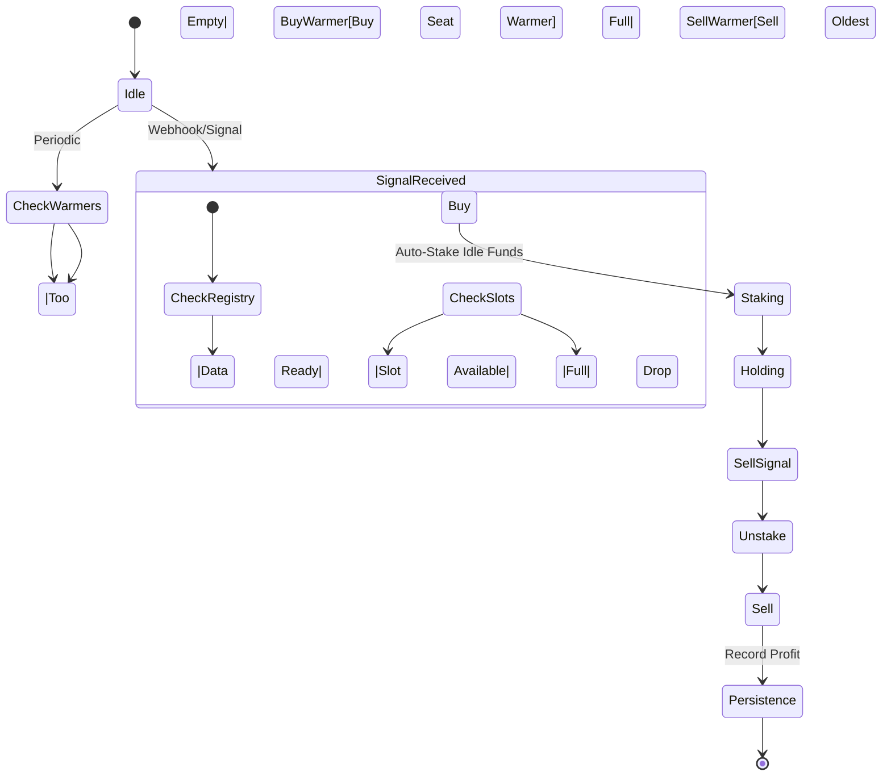

## Agent Instructions
Review official docs:  
- https://github.com/coinbase/coinbase-advanced-py/  
- https://docs.kraken.com/api/docs/guides/global-intro  
- https://docs.binance.us/#introduction  


This file is mirrored across CLAUDE.md, AGENTS.md, and GEMINI.md so the same instructions load in any AI environment.

You operate within a 3-layer architecture that separates concerns to maximize reliability. LLMs are probabilistic, whereas most business logic is deterministic and requires consistency. This system fixes that mismatch.

### The 3-Layer Architecture

**Layer 1: Directive (What to do)**  
- Markdown SOPs in `directives/` (or embedded here).  
- Define goals, inputs, tools/scripts to use, outputs, edge cases.  
- Natural language instructions, like you'd give a mid-level employee.

**Layer 2: Orchestration (Decision making)**  
- This is you (the AI). Your job: intelligent routing.  
- Read directives, call execution tools/scripts in the right order, handle errors, ask for clarification, update directives with learnings.  
- You're the glue between intent and execution. E.g., don't try scraping websites yourself—read `directives/scrape_website.md` and run `execution/scrape_single_site.py`.  
- Focus on decision-making; push complexity to deterministic code.

“Before writing any code, scan and quote the exact balance-fetching examples from the linked official docs—Binance, Kraken, Coinbase—treat them as gospel, no shortcuts, no CCXT, just pure SDK calls.this is MUST just as using Decimal is MUSt with money”

**Layer 3: Execution (Doing the work)**  
- Deterministic Python scripts in `execution/` (or equivalent).  
- Environment variables, API tokens, etc. stored in `.env`.  
- Handle API calls, data processing, file operations, database interactions.  
- Reliable, testable, fast. Use scripts instead of manual work. Commented well.

**Why this works:** If you do everything yourself, errors compound. 90% accuracy per step = 59% success over 5 steps. The solution is push complexity into deterministic code. That way you just focus on decision-making.

### Operating Principles

1. **Check for tools first**  
   Before writing a script, check existing ones in `execution/` per your directive. Only create new scripts if none exist.

2. **Self-anneal when things break**  
   - Read error message and stack trace.  
   - Fix the script and test it again (unless it uses paid tokens/credits/etc.—in which case check with user first).

Now apply this architecture to the project below.

## Project Goal & Hexagonal Refactor Instructions

This is a cryptocurrency arbitrage and hedging bot designed for a ~$10,000 budget in January 2026.

### Core Strategy (100% to be preserved)
# System Visual Architecture

> [!NOTE]
> This document visualizes the live connections within the system, proving that all components are strictly wired and functional.

## 1. High-Level System Architecture
The **SystemCoordinator** ([main.py](file:///Users/dj3bosmacbookpro/Desktop/quant_bot_FIXED/main.py)) acts as the kernel, initializing the unified **DataFeed** and **MarketRegistry** before launching the three specialized bots.

```mermaid
graph TD
    %% Nodes
    Main[System Coordinator]
    
    subgraph "Core Infrastructure"
        DF[DataFeed (WebSockets)]
        REG[MarketRegistry (VRAM)]
        PM[PersistenceManager (SQLite)]
        RISK[RiskManager]
    end
    
    subgraph "Trading Engines"
        Q[Q-Bot (Arbitrage)]
        A[A-Bot (Sniper)]
        G[G-Bot (Gold)]
    end
    
    subgraph "External"
        Exchanges((Exchanges))
    end

    %% Connections
    Main -->|Initializes| DF
    Main -->|Initializes| REG
    Main -->|Initializes| PM
    Main -->|Launches| Q
    Main -->|Launches| A
    Main -->|Launches| G

    DF -->|Push Realtime Data| REG
    DF -->|Push Metrics| PM
    
    Q -->|Read Context| REG
    Q -->|Get Metrics| DF
    A -->|Read Books| REG
    G -->|Read Prices| REG
    
    Q -->|Execute| RISK
    A -->|Execute| RISK
    
    RISK -->|Approved| Exchanges
    
    style Main fill:#f9f,stroke:#333
    style DF fill:#bbf,stroke:#333
    style REG fill:#dfd,stroke:#333,stroke-dasharray: 5 5
    style Q fill:#fcc,stroke:#333
    style A fill:#cfc,stroke:#333
    style G fill:#ffc,stroke:#333
```

---

## 2. The Data Pipeline (The "Circulatory System")
How data moves from the exchange to the bot's brain in milliseconds. Note the **Data Injection** into the GNN.



---

## 3. Q-Bot Logic Flow (The "Brain")
This proves the integration of the **Auction Module**, **GNN**, and **Liquidity Analyzer**.



---

## 4. A-Bot Sniper Logic (Dependency Chain)
Demonstrates the dependency on `StakingManager` and `SeatWarmers`.




**Rules**:
- Never change the strategy, settings, or existing nomenclature without approval and confirmation.
- Use Decimal everywhere for money calculations.

